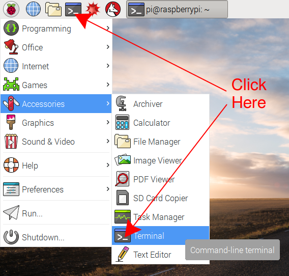

# Using a Raspberry Pi

This guide is not intended to be a full description of how to use a Raspberry Pi, but it will give you a few pointers on how to keep the software up-to-date and on some of the things you can do with the computer.

## Using the terminal

When you've used computers in the past with operating systems like Windows or OS X, you'll have used a graphical user interface (GUI) to control the computer. With a GUI you use the mouse pointer to click on menus and icons. While Raspbian does have a GUI, you'll need to learn to use the **terminal** to properly in order to make full use of the Raspberry Pi.

- Open the terminal by going to **Menu** > **Accessories** > **Terminal**, or by clicking on the terminal icon in the tool bar on the desktop.




## Keeping up-to-date
- One of the most important commands to learn is the one to update the software on the Raspberry Pi. To do this, you first need to update the list of software available.

``` bash
sudo apt-get update
```

- Next you can upgrade all installed software

``` bash
sudo apt-get upgrade -y
```

### A note on `sudo`
- `sudo` is short for **superuser do**. It's basically running a command as an administrator. Many commands need administrator permission to run, so need to be typed using `sudo`.

## Other useful commands
- You can use the GUI for most things on the Raspberry Pi, but many online tutorials and guides will assume you're using a terminal, so it is best to become acquainted with a few terminal commands.

| Command     | Name             | Example                            | Description                                                        |
|-------------|------------------|------------------------------------|--------------------------------------------------------------------|
| ls          | list             | `ls`                               | list the files in the current directory                            |
| ls -a       | list all         | `ls -a`                            | list all the files including hidden ones                           |
| cd          | change directory | `cd ~/Documents`                   | change to the `Documents` directory                                |
| cd ..       | change directory | `cd ..`                            | change to the parent directory                                     |
| touch       | touch            | `touch test.txt`                   | create a file called `test.txt`                                    |
| mv          | move             | `mv test.txt ~/Documents/TEST.txt` | move the `test.txt` file to `Documents` and change its name        |
| cp          | copy             | `cp test.txt test.bak`             | copy the `test.txt` file and name it `test.bak`                    |
| rm          | remove           | `rm test.txt`                      | delete the `test.txt` file permanently                             |
| rm -r       | recursive remove | `rm -r Documents`                  | delete the `Documents` directory and all it's contents permanently |
| nano        | nano             | `nano test.txt`                    | Open or create the file `test.txt` for editing in nano             |
| hostname -I | hostname         | `hostname -I`                      | Display the IP address of the Raspberry Pi                         |

### A note on tilde
- The tilde symbol `~` is used to represent the `home` folder. This is normally `/home/pi`. So when you type `ls ~/`, this is the same as typing `ls /home/pi`.

## Installing new software

At some point you'll most probably want to install some new software onto your Raspberry Pi. Again, it is easiest to use the terminal to do this.

- You can search for software that is available to install, but you need to update the software list first

``` bash
sudo apt-get update
```

- Then you can start a search. For instance if you wanted to install the game Tetris, you can search for software with *tetris* in the name.

``` bash
sudo apt-cache search tetris
```

- You can then choose the program you want from the list. In this case you could install `tint`

``` bash
sudo apt-get install tint
```

- Some types of software will then appear in the **Menu**. Other types need to be launched from the terminal

``` bash
tint
```
